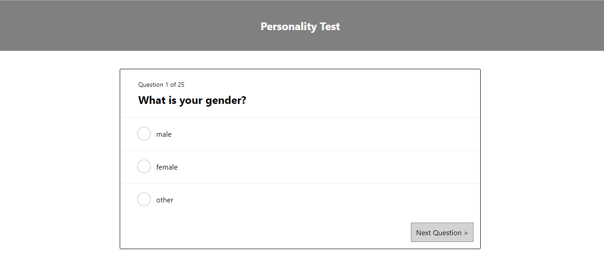
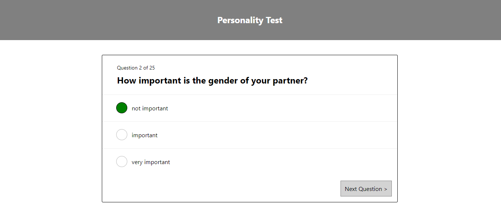

# Personality Test

### Description

It will allows a user to answer questions for a personality test based on the data provided in the JSON file.

- Each page shows the one question and corresponding answers for that question.
- These answer types are specified in the JSON file for each question.
- The answers to the questions are stored in Database(Mongo DB), so they can be retrieved at any time and can be used for further reference.
- This test can work on any device.
- Once we run the application, web view will look like as below.

###### Starting screen:


###### Screen with user answers:


### Get it running

- Install the dependences -  ``` npm install ```
- Run the application - ``` npm start ```
- Start the express server - ``` npm run start:server ```
- Run the tests - ``` npm test ```

